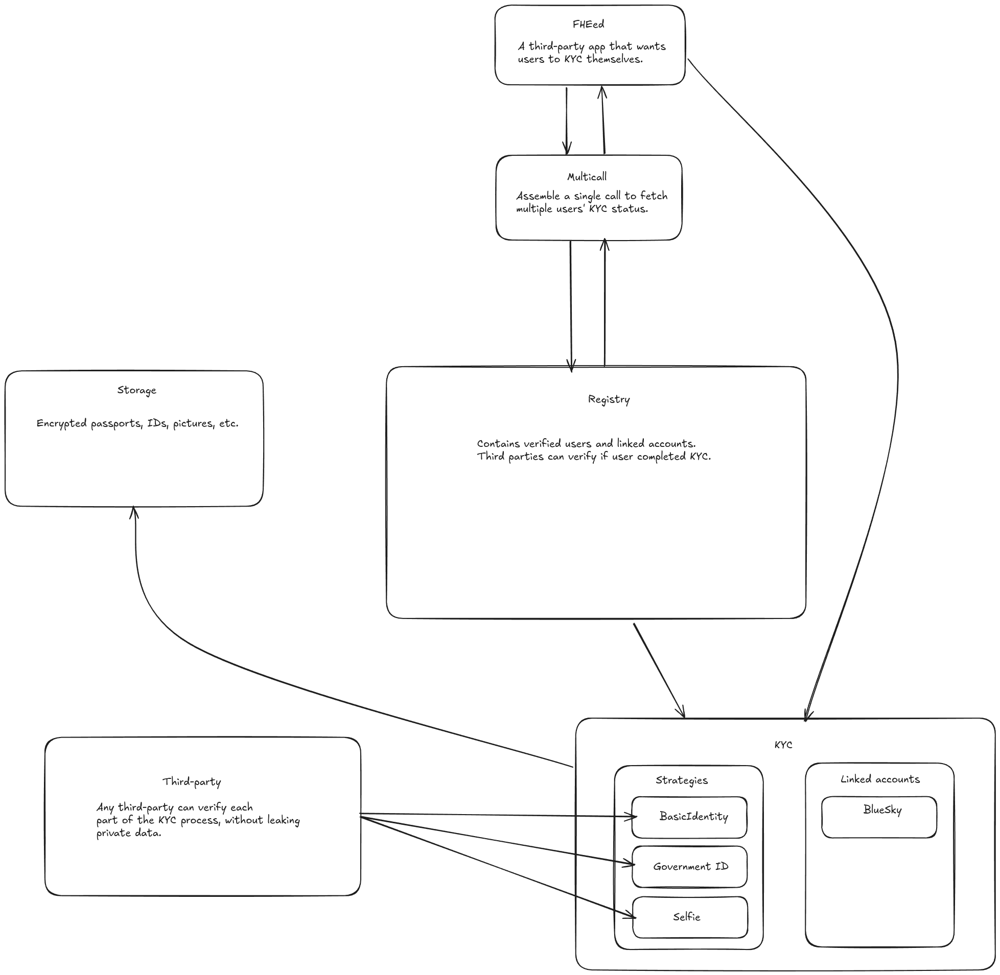

# FHEed

This project has been submitted to Aleph de Verano Hackathon's Building the future with FHE bounty.

FHEed is a proof of humanity platform and serves as a foundation for selective disclosures.

## General architecture



## KYC

### Strategies

- Basic identity verification:

  - Full name,
  - Date of birth
  - Gender
  - Nationality

- Identity Proof w/ Government-Issued ID

  Extract metadata from Machine Readable Zone of passports and IDs.  
  Furthermore, existing tools like OpenPassport can generate ZK proofs on user's passports and goverment IDs. This workflow can be integrated to further strengthen the KYC process.

- Selfie Verification

  Users can submit a selfie and verify their personhood.  
  An encrypted version of the selfie is submitted to the Storage contract. This image can be checked by third-parties for validity with ConcreteML.

These verification processes work in an "optimistic" model, the initial verification happens on the client side and the encrypted data and the results are uploaded to the smart contract. The feed or other service that wants to use the service can download the encrypted data and challenge their validity with tools like ConcreteML. This works similarly to fault-prover where any user can challenge a proposal made by other users.  
This can be improved by creating proof of executions for each strategy, see [Greco](https://eprint.iacr.org/2024/594.pdf).

## The FHEed

The feed is essentially is a middleware that takes a feed's output and reorganizes it favouring users that have been verified.
`feed` contains a proof-of-concept feed, it is essentially a following feed w/ the following structure:

- posts of verified users
- a post marking the breakpoint between posts by verified and unverified users
- posts by unverified users

## TODOs

- [ ] Move the Storage to ipfs  
- [ ] Add account abstraction w/ platforms as paymasters  
- [ ] Feed

### How to deploy on Sepolia

First, before launching the React app, you must deploy the `ConfidentialERC20` smart contract and mint the first few tokens.
To do this, go to the `hardhat/` directory, and follow all the instructions from the [`README`](/hardhat/README.md) there to deploy and mint the first tokens with Alice's account, i.e until you are able to run the following command:

```
npm run deploy-sepolia
```

> **Note:** Be careful to use your own private mnemonic key in this case, in the `.env` file (do not reuse the public values from `.env.example`!).

After you succesfully run the Sepolia deployment script, go to the `frontend/` directory, and just run those two commands:

```
npm install
npm run dev
```

This will launch the front-end of the dApp from a local Vite server, which will be available at the following URL: [`http://localhost:4173/`](http://localhost:4173/) . You can connect to the dApp with a Web3 wallet such as Metamask and start transferring tokens, reencrypt and read your balance, or request the decryption of the encrypted secret on Sepolia.

### How to use in Mocked mode

First go to the `hardhat/` directory : define a new `.env` file - in mocked mode, simply doing a copy `cp .env.example .env` is doable, but you can also you your own private mnemonic - then install all packages with
`npm i`. Now you can launch the hardhat local node with:

```
npx hardhat node
```

This will also launch a mocked instance of the coprocessor.

You can then go to the `frontend/` directory, and just run those two commands:

```
npm install
npm run dev-mocked
```

The dApp will be available again at: [`http://localhost:4173/`](http://localhost:4173/) . You can connect to the dApp with a Web3 wallet such as Metamask and start transferring tokens, reencrypt and read your balance, or request the decryption of the encrypted. This time, the only difference is that it will ask you to connect to the Hardhat network instead of Sepolia, so make sure to have added the Hardhat network to your Metamask wallet in order to be able to use the dApp with the mocked coprocessor. You can find instructions to configure Metamask adequatly [here](https://support.chainstack.com/hc/en-us/articles/4408642503449-Using-MetaMask-with-a-Hardhat-node).

#### Troubleshooting

**_Invalid nonce errors:_** This is a common issue everytime you restart your local Hardhat node and you want to reuse the same accounts in Metamask. You should remember to reset the nonce of the accounts you used the last time with Hardhat. To reset the account's transaction history and the nonce, open Metamask and select the Hardhat network, click on your account followed by `Settings -> Advanced -> Clear activity tab data`.
